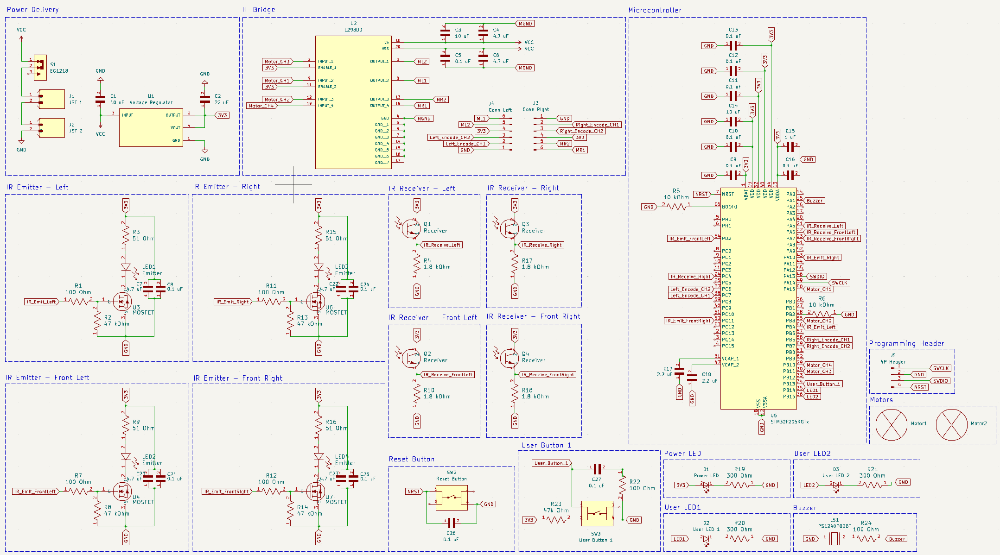
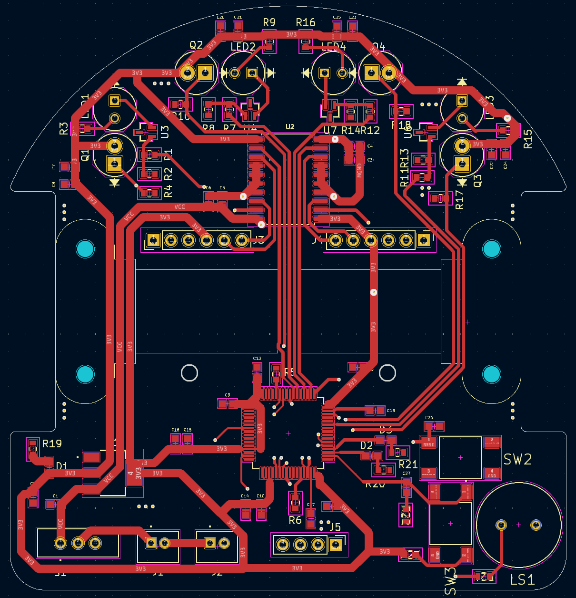

# The Harness
"The Harness" is my custom-designed micromouse to compete in the 2025 All American Micromouse Competition (AAMC). This design is a lot more compact and sleak than my initial design which competed in the 2024 AAMC and placed 5th overall.

All of the PCB design files can be found in "mouse_schematic.zip" and all of the software can be found in the "software" folder.

## Schematic
The schematic was made in KiCad 8.0. 

## PCB
The PCB was also made in KiCad 8.0. The GND planes are hidden in the images below.

  
  

